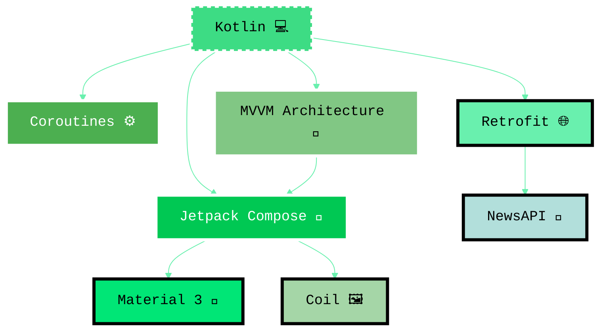
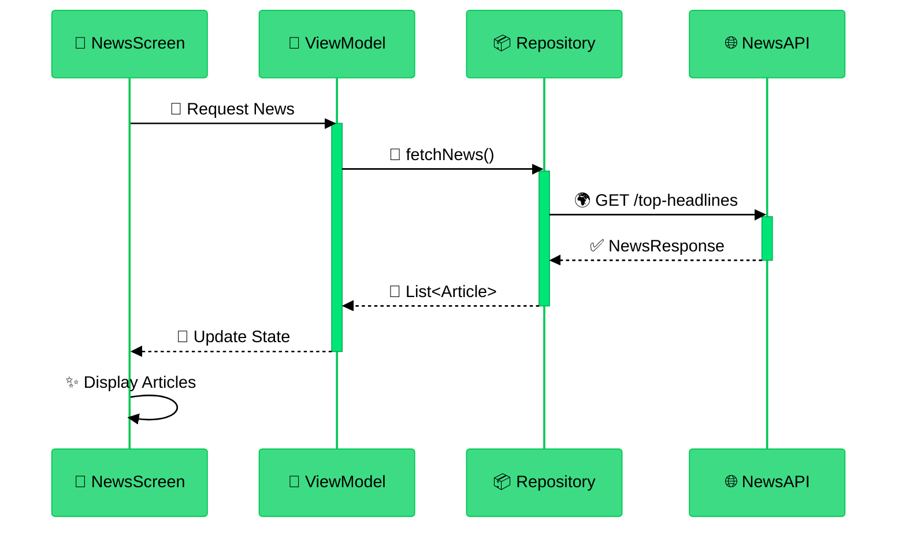
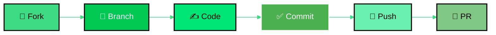

<div align="center">

<!-- Hero Section with Glassmorphism Effect -->
<picture>
  <source media="(prefers-color-scheme: dark)" srcset="https://capsule-render.vercel.app/api?type=waving&color=gradient&customColorList=12,17,20,24,28&height=200&section=header&text=ALZAJEERA%20NEWS&fontSize=50&fontColor=3DDC84&animation=fadeIn&fontAlignY=38&desc=Modern%20Android%20News%20Application&descAlignY=55&descAlign=50"/>
  
</picture>

<br/>

<!-- App Icon with Glass Effect -->
<kbd>
  
</kbd>

<br/>
<br/>

<!-- Animated Typing Text -->


<br/>
<br/>

<!-- Glass Panel with Badges -->
<table>
  <tr>
    <td align="center">
      <kbd>
        <br/>
        
        
        
        <br/><br/>
        
        
        
        <br/>
      </kbd>
    </td>
  </tr>
</table>

<br/>

<!-- Stats Badges with Glass Effect -->
<kbd>
  <br/>
  
  
  
  
  <br/><br/>
</kbd>

<br/>

```
▂▃▅▇█ 🚀 EXPERIENCE NEWS LIKE NEVER BEFORE █▇▅▃▂
```

<br/>

[📥 Quick Start](#-getting-started) • [📸 Screenshots](#-app-showcase) • [✨ Features](#-features) • [🛠️ Tech Stack](#️-tech-stack) • [🤝 Contribute](#-contributing)

<br/>

---

</div>

<br/>

## 📸 APP SHOWCASE

<div align="center">

### 💎 Material Design 3 | Android Green Theme

<br/>

<!-- Glassmorphism Screenshots -->
<table>
  <tr>
    <td width="50%" align="center">
      <kbd>
        
      </kbd>
    </td>
    <td width="50%" align="center">
      <kbd>
        
      </kbd>
    </td>
  </tr>
  <tr>
    <td align="center">
      <br/>
      <kbd>
        <br/>
        <b>🏠 HOME SCREEN</b>
        <br/><br/>
      </kbd>
      <br/><br/>
      <table>
        <tr><td>📱 Modern Feed Layout</td></tr>
        <tr><td>⚡ Real-time Updates</td></tr>
        <tr><td>🔄 Pull to Refresh</td></tr>
        <tr><td>🎨 Material 3 Design</td></tr>
      </table>
    </td>
    <td align="center">
      <br/>
      <kbd>
        <br/>
        <b>📰 NEWS ARTICLE</b>
        <br/><br/>
      </kbd>
      <br/><br/>
      <table>
        <tr><td>📖 Rich Content Display</td></tr>
        <tr><td>🖼️ High-Quality Images</td></tr>
        <tr><td>📝 Detailed Information</td></tr>
        <tr><td>⚡ Fast Loading</td></tr>
      </table>
    </td>
  </tr>
</table>

<br/>

</div>

---

<br/>

## ✨ FEATURES

<div align="center">

### 🌟 Powered by Modern Android Technologies

<br/>

<!-- Glass Panel Features -->
<table>
<tr>
<td width="33%" align="center">
<kbd>
<br/>

### 🤖
### Android Native
<sub>Pure Kotlin Code</sub>
<br/>
<sub>Jetpack Compose</sub>
<br/>
<sub>Material Design 3</sub>
<br/><br/>

</kbd>
</td>
<td width="33%" align="center">
<kbd>
<br/>

### ⚡
### Performance
<sub>Smooth 60+ FPS</sub>
<br/>
<sub>Optimized Loading</sub>
<br/>
<sub>Efficient Caching</sub>
<br/><br/>

</kbd>
</td>
<td width="33%" align="center">
<kbd>
<br/>

### 🔄
### Real-time
<sub>Live News Feed</sub>
<br/>
<sub>Auto Refresh</sub>
<br/>
<sub>Push Updates</sub>
<br/><br/>

</kbd>
</td>
</tr>

<tr>
<td width="33%" align="center">
<kbd>
<br/>

### 🌐
### Networking
<sub>Retrofit API</sub>
<br/>
<sub>Error Handling</sub>
<br/>
<sub>Retry Logic</sub>
<br/><br/>

</kbd>
</td>
<td width="33%" align="center">
<kbd>
<br/>

### 🖼️
### Media
<sub>Coil Loading</sub>
<br/>
<sub>Image Caching</sub>
<br/>
<sub>Lazy Loading</sub>
<br/><br/>

</kbd>
</td>
<td width="33%" align="center">
<kbd>
<br/>

### 🎨
### Design
<sub>Responsive UI</sub>
<br/>
<sub>Dark Mode</sub>
<br/>
<sub>Animations</sub>
<br/><br/>

</kbd>
</td>
</tr>
</table>

<br/>

<!-- Feature List in Glass Panel -->
<kbd>
<table>
  <tr>
    <td width="50%">
      <br/>
      <b>📱 USER EXPERIENCE</b><br/><br/>
      ✅ Intuitive Navigation<br/>
      ✅ Smooth Scrolling<br/>
      ✅ Pull to Refresh<br/>
      ✅ Loading States<br/>
      ✅ Error Recovery<br/>
      ✅ Offline Support<br/>
      <br/>
    </td>
    <td width="50%">
      <br/>
      <b>🔧 TECHNICAL</b><br/><br/>
      ✅ MVVM Architecture<br/>
      ✅ Kotlin Coroutines<br/>
      ✅ State Management<br/>
      ✅ Repository Pattern<br/>
      ✅ Clean Code<br/>
      ✅ Scalable Structure<br/>
      <br/>
    </td>
  </tr>
</table>
</kbd>

</div>

<br/>

---

<br/>

## 🛠️ TECH STACK

<div align="center">

### 💚 Built with Modern Android Ecosystem

<br/>



<br/>

### 📦 Core Technologies Stack

<br/>

<!-- Enhanced Glass Panel with Hover Effects -->
<table>
  <tr>
    <td align="center">
      <kbd>
        <table>
          <tr>
            <td align="center" width="16.66%">
              <br/>
              <a href="https://kotlinlang.org/" target="_blank">
                
              </a>
              <br/><br/>
              
              <br/><br/>
              <sub><b>🔷 Core Language</b></sub><br/>
              <sub>Modern & Concise</sub>
              <br/><br/>
            </td>
            <td align="center" width="16.66%">
              <br/>
              <a href="https://developer.android.com/jetpack/compose" target="_blank">
                
              </a>
              <br/><br/>
              
              <br/><br/>
              <sub><b>🎨 UI Toolkit</b></sub><br/>
              <sub>Declarative UI</sub>
              <br/><br/>
            </td>
            <td align="center" width="16.66%">
              <br/>
              <a href="https://square.github.io/retrofit/" target="_blank">
                
              </a>
              <br/><br/>
              
              <br/><br/>
              <sub><b>🌐 HTTP Client</b></sub><br/>
              <sub>Type-safe REST</sub>
              <br/><br/>
            </td>
            <td align="center" width="16.66%">
              <br/>
              <a href="https://coil-kt.github.io/coil/" target="_blank">
                
              </a>
              <br/><br/>
              
              <br/><br/>
              <sub><b>🖼️ Image Loader</b></sub><br/>
              <sub>Kotlin-first</sub>
              <br/><br/>
            </td>
            <td align="center" width="16.66%">
              <br/>
              <a href="https://kotlinlang.org/docs/coroutines-overview.html" target="_blank">
                
              </a>
              <br/><br/>
              
              <br/><br/>
              <sub><b>⚡ Async Handler</b></sub><br/>
              <sub>Non-blocking</sub>
              <br/><br/>
            </td>
            <td align="center" width="16.66%">
              <br/>
              <a href="https://developer.android.com/topic/architecture" target="_blank">
                
              </a>
              <br/><br/>
              
              <br/><br/>
              <sub><b>🏗️ Architecture</b></sub><br/>
              <sub>Clean & Testable</sub>
              <br/><br/>
            </td>
          </tr>
        </table>
      </kbd>
    </td>
  </tr>
</table>

<br/>

### 🔧 Technical Implementation

<br/>

<kbd>
<table>
  <tr>
    <td width="33%" align="center">
      <br/>
      
      <br/><br/>
      <b>🎨 UI/UX</b><br/><br/>
      ✅ Material Components<br/>
      ✅ Dynamic Theming<br/>
      ✅ Adaptive Layouts<br/>
      ✅ Smooth Animations<br/>
      <br/>
    </td>
    <td width="33%" align="center">
      <br/>
      
      <br/><br/>
      <b>⚙️ Concurrency</b><br/><br/>
      ✅ Structured Concurrency<br/>
      ✅ Flow & StateFlow<br/>
      ✅ Exception Handling<br/>
      ✅ Lifecycle Aware<br/>
      <br/>
    </td>
    <td width="33%" align="center">
      <br/>
      
      <br/><br/>
      <b>🌐 Network</b><br/><br/>
      ✅ RESTful API Calls<br/>
      ✅ JSON Parsing<br/>
      ✅ Error Interceptors<br/>
      ✅ Logging Support<br/>
      <br/>
    </td>
  </tr>
</table>
</kbd>

<br/>

### 📊 Architecture Layers

<br/>

<table>
  <tr>
    <td width="25%" align="center">
      <kbd>
        <br/>
        
        <br/><br/>
        
        <br/><br/>
        <sub>📱 UI Components</sub><br/>
        <sub>🎨 Jetpack Compose</sub><br/>
        <sub>🖼️ Material 3</sub><br/>
        <br/>
      </kbd>
    </td>
    <td width="25%" align="center">
      <kbd>
        <br/>
        
        <br/><br/>
        
        <br/><br/>
        <sub>🧠 Business Logic</sub><br/>
        <sub>📋 Use Cases</sub><br/>
        <sub>🎯 Models</sub><br/>
        <br/>
      </kbd>
    </td>
    <td width="25%" align="center">
      <kbd>
        <br/>
        
        <br/><br/>
        
        <br/><br/>
        <sub>🌐 Repository</sub><br/>
        <sub>📡 API Service</sub><br/>
        <sub>💾 Data Sources</sub><br/>
        <br/>
      </kbd>
    </td>
    <td width="25%" align="center">
      <kbd>
        <br/>
        
        <br/><br/>
        
        <br/><br/>
        <sub>🔌 Retrofit</sub><br/>
        <sub>📰 NewsAPI</sub><br/>
        <sub>🔄 Interceptors</sub><br/>
        <br/>
      </kbd>
    </td>
  </tr>
</table>

</div>

<br/>

---

<br/>

## 📁 PROJECT ARCHITECTURE

<div align="center">

### 🏗️ Clean & Scalable Structure

<br/>

<kbd>
<br/>

```
📦 com.example.alzajeeraapp
┃
┣━━ 📂 model
┃   ┣━━ 📄 NewsArticle.kt        ━━━━━━━━━ 📰 Article Data Model
┃   ┣━━ 📄 NewsResponse.kt       ━━━━━━━━━ 📦 API Response Model
┃   ┗━━ 📄 NewsApiService.kt     ━━━━━━━━━ 🌐 Retrofit Interface
┃
┣━━ 📂 view
┃   ┗━━ 📄 NewsScreen.kt         ━━━━━━━━━ 🎨 Compose UI Screen
┃
┣━━ 📂 viewmodel
┃   ┗━━ 📄 NewsViewModel.kt      ━━━━━━━━━ 🧠 Business Logic
┃
┣━━ 📂 ui/theme
┃   ┣━━ 📄 Color.kt              ━━━━━━━━━ 🎨 Color Palette
┃   ┣━━ 📄 Theme.kt              ━━━━━━━━━ 🌈 Material Theme
┃   ┗━━ 📄 Type.kt               ━━━━━━━━━ ✍️ Typography
┃
┗━━ 📄 MainActivity.kt            ━━━━━━━━━ 🚀 App Entry Point
```

<br/>
</kbd>

<br/>

### 🔄 Data Flow Architecture

<br/>



</div>

<br/>

---

<br/>

## 🚀 GETTING STARTED

<div align="center">

### ⚡ Quick Setup in 4 Easy Steps

<br/>

</div>

### 📋 Prerequisites

<div align="center">

<kbd>
<br/>

| Component | Version | Status |
|:---------:|:-------:|:------:|
| **🔧 Android Studio** | Flamingo+ |  |
| **🤖 Kotlin** | 1.8.0+ |  |
| **🏗️ Gradle** | 8.11.1+ |  |
| **📱 Min SDK** | 24 (Nougat) |  |
| **🎯 Target SDK** | 34 (Android 14) |  |

<br/>
</kbd>

</div>

<br/>

### 📥 Installation

<div align="center">

<kbd>
<br/>

```bash
# 1️⃣ Clone the Repository
git clone https://github.com/DAlgoSculptor/Alzajeera-News-App.git

# 2️⃣ Navigate to Directory
cd Alzajeera-News-App

# 3️⃣ Open in Android Studio
# File → Open → Select Project Directory

# 4️⃣ Sync & Build
# Let Gradle sync and build the project
```

<br/>
</kbd>

</div>

<br/>

### 🔑 API Configuration

<div align="center">

<kbd>
<br/>

**Get your FREE API key from [NewsAPI.org](https://newsapi.org/) 🌟**

<br/><br/>

```kotlin
// 📂 Navigate to: NewsRepository.kt
// 🔧 Replace with your API key

private val apiKey = "your_actual_api_key_here"  // 🔐 Paste here
```

<br/>
</kbd>

</div>

<br/>

### 🎯 Build & Run

<div align="center">

<kbd>
<table>
  <tr>
    <td align="center" width="25%">
      <br/>
      <b>1️⃣</b><br/>
      🔄 <b>Sync Gradle</b><br/>
      <sub>Wait for sync</sub><br/><br/>
    </td>
    <td align="center" width="25%">
      <br/>
      <b>2️⃣</b><br/>
      🏗️ <b>Build Project</b><br/>
      <sub>Build → Rebuild</sub><br/><br/>
    </td>
    <td align="center" width="25%">
      <br/>
      <b>3️⃣</b><br/>
      🚀 <b>Run App</b><br/>
      <sub>Press ▶️</sub><br/><br/>
    </td>
    <td align="center" width="25%">
      <br/>
      <b>4️⃣</b><br/>
      🎉 <b>Enjoy!</b><br/>
      <sub>App is running</sub><br/><br/>
    </td>
  </tr>
</table>
</kbd>

</div>

<br/>

---

<br/>

## 📦 DEPENDENCIES

<div align="center">

### 🎁 Powerful Libraries

<br/>

<details>
<summary><kbd><b>📚 Click to View All Dependencies</b></kbd></summary>

<br/>

<kbd>

```gradle
dependencies {
    // 🤖 Core Kotlin & Android
    implementation 'androidx.core:core-ktx:1.12.0'
    implementation 'androidx.lifecycle:lifecycle-runtime-ktx:2.7.0'
    implementation 'androidx.activity:activity-compose:1.8.2'
    
    // 🎨 Jetpack Compose - Modern UI Toolkit
    implementation platform('androidx.compose:compose-bom:2024.02.00')
    implementation 'androidx.compose.ui:ui'
    implementation 'androidx.compose.ui:ui-graphics'
    implementation 'androidx.compose.ui:ui-tooling-preview'
    implementation 'androidx.compose.material3:material3'
    
    // 🌐 Networking - Retrofit
    implementation 'com.squareup.retrofit2:retrofit:2.9.0'
    implementation 'com.squareup.retrofit2:converter-gson:2.9.0'
    implementation 'com.squareup.okhttp3:logging-interceptor:4.11.0'
    
    // 🖼️ Image Loading - Coil
    implementation 'io.coil-kt:coil-compose:2.5.0'
    
    // 🧪 Testing
    testImplementation 'junit:junit:4.13.2'
    androidTestImplementation 'androidx.test.ext:junit:1.1.5'
    androidTestImplementation 'androidx.test.espresso:espresso-core:3.5.1'
    androidTestImplementation 'androidx.compose.ui:ui-test-junit4'
    
    // 🔧 Debug Tools
    debugImplementation 'androidx.compose.ui:ui-tooling'
    debugImplementation 'androidx.compose.ui:ui-test-manifest'
}
```

</kbd>

</details>

</div>

<br/>

---

<br/>

## 🎨 KEY FEATURES

<div align="center">

### 🌟 What Makes This App Special

<br/>

<kbd>
<table>
<tr>
<td width="50%">
<br/>

#### 🏠 **Home Screen Excellence**

✅ Material 3 Design System<br/>
✅ LazyColumn Performance<br/>
✅ Pull-to-Refresh Gesture<br/>
✅ Shimmer Loading Effects<br/>
✅ Error State with Retry<br/>
✅ Empty State Handling<br/>
✅ Smooth Animations<br/>
<br/>

</td>
<td width="50%">
<br/>

#### 📰 **Rich Article Display**

✅ HD Image Display<br/>
✅ Title & Description<br/>
✅ Source Attribution<br/>
✅ Published Timestamp<br/>
✅ Card-Based Layout<br/>
✅ Click to Read More<br/>
✅ Responsive Design<br/>
<br/>

</td>
</tr>

<tr>
<td width="50%">
<br/>

#### 🔧 **Technical Excellence**

✅ MVVM Architecture<br/>
✅ Kotlin Coroutines<br/>
✅ State Management<br/>
✅ DI Ready<br/>
✅ Repository Pattern<br/>
✅ Clean Code<br/>
<br/>

</td>
<td width="50%">
<br/>

#### ⚡ **Performance & UX**

✅ Fast Network Calls<br/>
✅ Efficient Memory<br/>
✅ Image Caching<br/>
✅ 60+ FPS UI<br/>
✅ Offline Handling<br/>
✅ Optimized Rendering<br/>
<br/>

</td>
</tr>
</table>
</kbd>

</div>

<br/>

---

<br/>

## 🔗 API INTEGRATION

<div align="center">

### 🌐 NewsAPI.org Integration

<br/>

<kbd>
<br/>

**Endpoint:**
```
GET https://newsapi.org/v2/top-headlines
```

<br/>

| Parameter | Type | Description | Default |
|:---------:|:----:|:-----------:|:-------:|
| `country` | string | News country | `us` |
| `apiKey` | string | Your API key | Required |
| `pageSize` | integer | Per page | `20` |
| `page` | integer | Page number | `1` |

<br/>

**Response:**

```json
{
  "status": "ok",
  "totalResults": 38,
  "articles": [
    {
      "source": { "id": null, "name": "Source Name" },
      "author": "Author Name",
      "title": "Article Title",
      "description": "Article Description",
      "url": "https://article-url.com",
      "urlToImage": "https://image-url.com",
      "publishedAt": "2024-01-01T12:00:00Z",
      "content": "Article content..."
    }
  ]
}
```

<br/>
</kbd>

</div>

<br/>

---

<br/>

## 🤝 CONTRIBUTING

<div align="center">

### 💚 Contributions Welcome!

<br/>



<br/>

### 📝 How to Contribute

<br/>

<kbd>
<br/>

**1️⃣ Fork the Project**
```bash
# Click Fork button at top
```

**2️⃣ Create Feature Branch**
```bash
git checkout -b feature/AmazingFeature
```

**3️⃣ Commit Changes**
```bash
git commit -m '✨ Add AmazingFeature'
```

**4️⃣ Push to Branch**
```bash
git push origin feature/AmazingFeature
```

**5️⃣ Open Pull Request**

<br/>
</kbd>

<br/>

### 🌟 Contributors

<a href="https://github.com/DAlgoSculptor/Alzajeera-News-App/graphs/contributors">
  
</a>

</div>

<br/>

---

<br/>

## 📄 LICENSE

<div align="center">

### ⚖️ MIT License

<br/>

<kbd>
<br/>

```
MIT License

Copyright (c) 2024 Danish Nawaz

Permission is hereby granted, free of charge, to any person obtaining a copy
of this software and associated documentation files (the "Software"), to deal
in the Software without restriction, including without limitation the rights
to use, copy, modify, merge, publish, distribute, sublicense, and/or sell
copies of the Software, and to permit persons to whom the Software is
furnished to do so, subject to the following conditions: