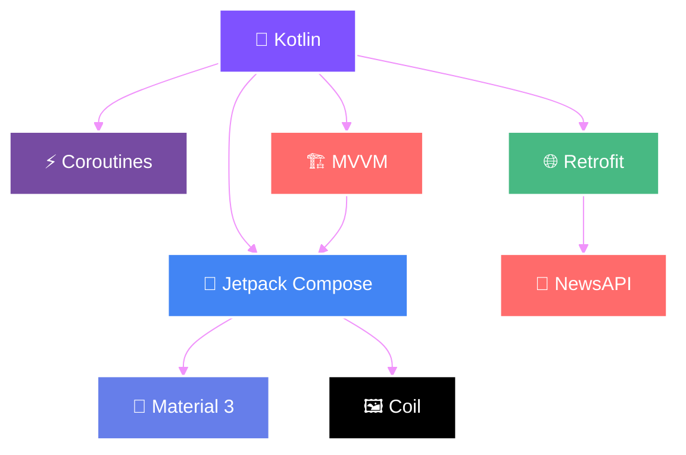
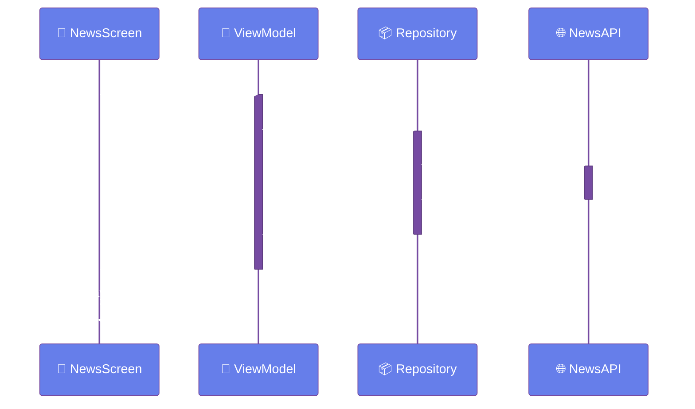
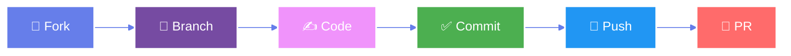

<div align="center">

# 📱✨ ALZAJEERA NEWS APP ✨📱


<br/>


<br/>
<br/>

<!-- Badges Section -->
<p align="center">
  
  
  
  
</p>

<p align="center">
  
  
  
  
</p>

<br/>

### 🚀 **Experience News Like Never Before**

*A cutting-edge Android news application that delivers real-time news with stunning Material 3 design*

<br/>

[📥 Download](#-getting-started) • [📸 Screenshots](#-app-showcase) • [✨ Features](#-features-that-wow) • [🛠️ Tech](#-tech-stack) • [🤝 Contribute](#-contributing)

<br/>

---

</div>

<br/>

## 📸 APP SHOWCASE

<div align="center">

### 🎨 Stunning Material 3 Design

<table>
  <tr>
    <td width="50%">
      
    </td>
    <td width="50%">
      
    </td>
  </tr>
  <tr>
    <td align="center">
      <br/>
      
      <br/><br/>
      <sub><b>📱 Modern Feed Layout</b></sub><br/>
      <sub>⚡ Real-time Updates</sub><br/>
      <sub>🔄 Pull to Refresh</sub><br/>
      <sub>🎨 Material 3 Design</sub>
    </td>
    <td align="center">
      <br/>
      
      <br/><br/>
      <sub><b>📖 Rich Content Display</b></sub><br/>
      <sub>🖼️ High-Quality Images</sub><br/>
      <sub>📝 Detailed Information</sub><br/>
      <sub>⚡ Fast Loading</sub>
    </td>
  </tr>
</table>

<br/>

</div>

---

<br/>

## ✨ FEATURES THAT WOW

<div align="center">

<table>
<tr>
<td width="33%" align="center">

### 📱
### **Modern UI**
<sub>Beautiful Material 3</sub>
<sub>Jetpack Compose</sub>
<sub>Smooth Animations</sub>

</td>
<td width="33%" align="center">

### 🔄
### **Real-time**
<sub>Live News Feed</sub>
<sub>Auto Updates</sub>
<sub>Pull to Refresh</sub>

</td>
<td width="33%" align="center">

### ⚡
### **Performance**
<sub>Fast Loading</sub>
<sub>Efficient Caching</sub>
<sub>Optimized Images</sub>

</td>
</tr>

<tr>
<td width="33%" align="center">

### 🌐
### **Network**
<sub>Retrofit Integration</sub>
<sub>Error Handling</sub>
<sub>Retry Mechanism</sub>

</td>
<td width="33%" align="center">

### 🖼️
### **Media**
<sub>Coil Image Loading</sub>
<sub>Lazy Loading</sub>
<sub>Placeholder Support</sub>

</td>
<td width="33%" align="center">

### 🎨
### **Design**
<sub>Responsive Layout</sub>
<sub>Dark Mode Ready</sub>
<sub>Custom Theming</sub>

</td>
</tr>
</table>

</div>

<br/>

---

<br/>

## 🛠️ TECH STACK

<div align="center">

### 💎 **Built With The Best**

<br/>



<br/>

### 📦 **Core Technologies**

<table>
  <tr>
    <td align="center" width="16.66%">
      <br/>
      
      <br/><br/>
      
      <br/>
      <sub><b>Language</b></sub>
    </td>
    <td align="center" width="16.66%">
      <br/>
      
      <br/><br/>
      
      <br/>
      <sub><b>UI Framework</b></sub>
    </td>
    <td align="center" width="16.66%">
      <br/>
      
      <br/><br/>
      
      <br/>
      <sub><b>Networking</b></sub>
    </td>
    <td align="center" width="16.66%">
      <br/>
      
      <br/><br/>
      
      <br/>
      <sub><b>Images</b></sub>
    </td>
    <td align="center" width="16.66%">
      <br/>
      
      <br/><br/>
      
      <br/>
      <sub><b>Async</b></sub>
    </td>
    <td align="center" width="16.66%">
      <br/>
      
      <br/><br/>
      
      <br/>
      <sub><b>Architecture</b></sub>
    </td>
  </tr>
</table>

</div>

<br/>

---

<br/>

## 📁 PROJECT ARCHITECTURE

<div align="center">

### 🏗️ **Clean & Scalable Structure**

<br/>

```
📦 com.example.alzajeeraapp
┃
┣━━ 📂 model
┃   ┣━━ 📄 NewsArticle.kt        ━━━━━━━━━ 📰 Article Data Model
┃   ┣━━ 📄 NewsResponse.kt       ━━━━━━━━━ 📦 API Response Model
┃   ┗━━ 📄 NewsApiService.kt     ━━━━━━━━━ 🌐 Retrofit Interface
┃
┣━━ 📂 view
┃   ┗━━ 📄 NewsScreen.kt         ━━━━━━━━━ 🎨 Compose UI Screen
┃
┣━━ 📂 viewmodel
┃   ┗━━ 📄 NewsViewModel.kt      ━━━━━━━━━ 🧠 Business Logic
┃
┣━━ 📂 ui/theme
┃   ┣━━ 📄 Color.kt              ━━━━━━━━━ 🎨 Color Palette
┃   ┣━━ 📄 Theme.kt              ━━━━━━━━━ 🌈 Material Theme
┃   ┗━━ 📄 Type.kt               ━━━━━━━━━ ✍️ Typography
┃
┗━━ 📄 MainActivity.kt            ━━━━━━━━━ 🚀 App Entry Point
```

<br/>

### 🔄 **Data Flow Architecture**



</div>

<br/>

---

<br/>

## 🚀 GETTING STARTED

<div align="center">

### ⚡ **Quick Setup Guide**

<br/>

</div>

### 📋 Prerequisites

<div align="center">

| Component | Version | Status |
|:---------:|:-------:|:------:|
| **🔧 Android Studio** | Flamingo+ |  |
| **🔷 Kotlin** | 1.8.0+ |  |
| **🏗️ Gradle** | 8.11.1+ |  |
| **📱 Min SDK** | 24 (Nougat) |  |
| **🎯 Target SDK** | 34 (Android 14) |  |

</div>

<br/>

### 📥 Installation

<div align="center">

```bash
# 1️⃣ Clone this awesome repository
git clone https://github.com/DAlgoSculptor/Alzajeera-News-App.git

# 2️⃣ Navigate to project directory
cd Alzajeera-News-App

# 3️⃣ Open in Android Studio
# File → Open → Select Project Directory
```

</div>

<br/>

### 🔑 API Configuration

<div align="center">

**Get your FREE API key from [NewsAPI.org](https://newsapi.org/) 🌟**

<br/>

```kotlin
// 📂 Navigate to: NewsRepository.kt
// 🔧 Replace with your API key

private val apiKey = "your_actual_api_key_here"  // 🔐 Add your key
```

</div>

<br/>

### 🎯 Build & Run

<div align="center">

| Step | Action | Description |
|:----:|:------:|:-----------:|
| **1️⃣** | 🔄 **Sync Gradle** | Wait for dependencies to download |
| **2️⃣** | 🏗️ **Build Project** | Build → Rebuild Project |
| **3️⃣** | 🚀 **Run App** | Click ▶️ or Shift + F10 |
| **4️⃣** | 🎉 **Enjoy!** | App running on your device! |

</div>

<br/>

---

<br/>

## 📦 DEPENDENCIES

<div align="center">

### 🎁 **Powerful Libraries Powering This App**

<br/>

<details>
<summary><b>📚 Click to View All Dependencies</b></summary>

<br/>

```gradle
dependencies {
    // 🔷 Core Kotlin & Android
    implementation 'androidx.core:core-ktx:1.12.0'
    implementation 'androidx.lifecycle:lifecycle-runtime-ktx:2.7.0'
    implementation 'androidx.activity:activity-compose:1.8.2'
    
    // 🎨 Jetpack Compose - Modern UI Toolkit
    implementation platform('androidx.compose:compose-bom:2024.02.00')
    implementation 'androidx.compose.ui:ui'
    implementation 'androidx.compose.ui:ui-graphics'
    implementation 'androidx.compose.ui:ui-tooling-preview'
    implementation 'androidx.compose.material3:material3'
    
    // 🌐 Networking - Retrofit
    implementation 'com.squareup.retrofit2:retrofit:2.9.0'
    implementation 'com.squareup.retrofit2:converter-gson:2.9.0'
    implementation 'com.squareup.okhttp3:logging-interceptor:4.11.0'
    
    // 🖼️ Image Loading - Coil
    implementation 'io.coil-kt:coil-compose:2.5.0'
    
    // 🧪 Testing
    testImplementation 'junit:junit:4.13.2'
    androidTestImplementation 'androidx.test.ext:junit:1.1.5'
    androidTestImplementation 'androidx.test.espresso:espresso-core:3.5.1'
    androidTestImplementation 'androidx.compose.ui:ui-test-junit4'
    
    // 🔧 Debug Tools
    debugImplementation 'androidx.compose.ui:ui-tooling'
    debugImplementation 'androidx.compose.ui:ui-test-manifest'
}
```

</details>

</div>

<br/>

---

<br/>

## 🎨 KEY FEATURES DEEP DIVE

<div align="center">

### 🌟 **What Makes This App Special**

<br/>

<table>
<tr>
<td width="50%">

#### 🏠 **Home Screen Excellence**

- ✅ Material 3 Design System
- ✅ LazyColumn for Performance
- ✅ Pull-to-Refresh Gesture
- ✅ Shimmer Loading Effects
- ✅ Error State with Retry
- ✅ Empty State Handling
- ✅ Smooth Scroll Animations

</td>
<td width="50%">

#### 📰 **Rich Article Display**

- ✅ High-Quality Image Display
- ✅ Article Title & Description
- ✅ Source Attribution
- ✅ Published Timestamp
- ✅ Card-Based Layout
- ✅ Click to Read More
- ✅ Responsive Design

</td>
</tr>

<tr>
<td width="50%">

#### 🔧 **Technical Excellence**

- ✅ MVVM Architecture Pattern
- ✅ Kotlin Coroutines
- ✅ State Management
- ✅ Dependency Injection Ready
- ✅ Repository Pattern
- ✅ Clean Code Structure

</td>
<td width="50%">

#### ⚡ **Performance & UX**

- ✅ Fast Network Calls
- ✅ Efficient Memory Usage
- ✅ Image Caching
- ✅ Smooth 60 FPS UI
- ✅ Offline Error Handling
- ✅ Optimized Rendering

</td>
</tr>
</table>

</div>

<br/>

---

<br/>

## 🔗 API INTEGRATION

<div align="center">

### 🌐 **NewsAPI.org Integration**

<br/>

**Endpoint Used:**
```
GET https://newsapi.org/v2/top-headlines
```

<br/>

| Parameter | Type | Description | Default |
|:---------:|:----:|:-----------:|:-------:|
| `country` | string | News country code | `us` |
| `apiKey` | string | Your API key | Required |
| `pageSize` | integer | Articles per page | `20` |
| `page` | integer | Page number | `1` |

<br/>

**Response Structure:**

```json
{
  "status": "ok",
  "totalResults": 38,
  "articles": [
    {
      "source": { "id": null, "name": "Source Name" },
      "author": "Author Name",
      "title": "Article Title",
      "description": "Article Description",
      "url": "https://article-url.com",
      "urlToImage": "https://image-url.com",
      "publishedAt": "2024-01-01T12:00:00Z",
      "content": "Article content..."
    }
  ]
}
```

</div>

<br/>

---

<br/>

## 🤝 CONTRIBUTING

<div align="center">

### 💖 **Contributions Make the Community Amazing!**

<br/>



<br/>

### 📝 **How to Contribute**

</div>

1. **🍴 Fork** the Project
   ```bash
   # Click the Fork button at the top of this page
   ```

2. **🌿 Create** your Feature Branch
   ```bash
   git checkout -b feature/AmazingFeature
   ```

3. **✍️ Commit** your Changes
   ```bash
   git commit -m '✨ Add some AmazingFeature'
   ```

4. **🚀 Push** to the Branch
   ```bash
   git push origin feature/AmazingFeature
   ```

5. **🎉 Open** a Pull Request

<br/>

<div align="center">

### 🌟 **Contributors**

<a href="https://github.com/DAlgoSculptor/Alzajeera-News-App/graphs/contributors">
  
</a>

</div>

<br/>

---

<br/>

## 📄 LICENSE

<div align="center">

### ⚖️ **Open Source & Free**

<br/>

```
MIT License

Copyright (c) 2024 Danish Nawaz

Permission is hereby granted, free of charge, to any person obtaining a copy
of this software and associated documentation files (the "Software"), to deal
in the Software without restriction, including without limitation the rights
to use, copy, modify, merge, publish, distribute, sublicense, and/or sell
copies of the Software.
```

<br/>

[](https://opensource.org/licenses/MIT)

</div>

<br/>

---

<br/>

## 👨‍💻 AUTHOR

<div align="center">


<br/>
<br/>

### 🚀 **Danish Nawaz**

*Passionate Android Developer | Kotlin Lover | Tech Enthusiast*

<br/>

[](https://github.com/DAlgoSculptor)
[](https://github.com/DAlgoSculptor)
[](https://linkedin.com)
[](mailto:your.email@example.com)

<br/>

**📂 Project Link:** [github.com/DAlgoSculptor/Alzajeera-News-App](https://github.com/DAlgoSculptor/Alzajeera-News-App)

</div>

<br/>

---

<br/>

## ⭐ SHOW YOUR SUPPORT

<div align="center">

### 🌟 **Give a Star if You Like This Project!**

<br/>


<br/>

### 💬 **Have Questions or Suggestions?**

Feel free to open an [issue](https://github.com/DAlgoSculptor/Alzajeera-News-App/issues/new) or reach out!

<br/>

---

<br/>


<br/>

**Made with ❤️ by [Danish Nawaz](https://github.com/DAlgoSculptor)**

<br/>


</div>