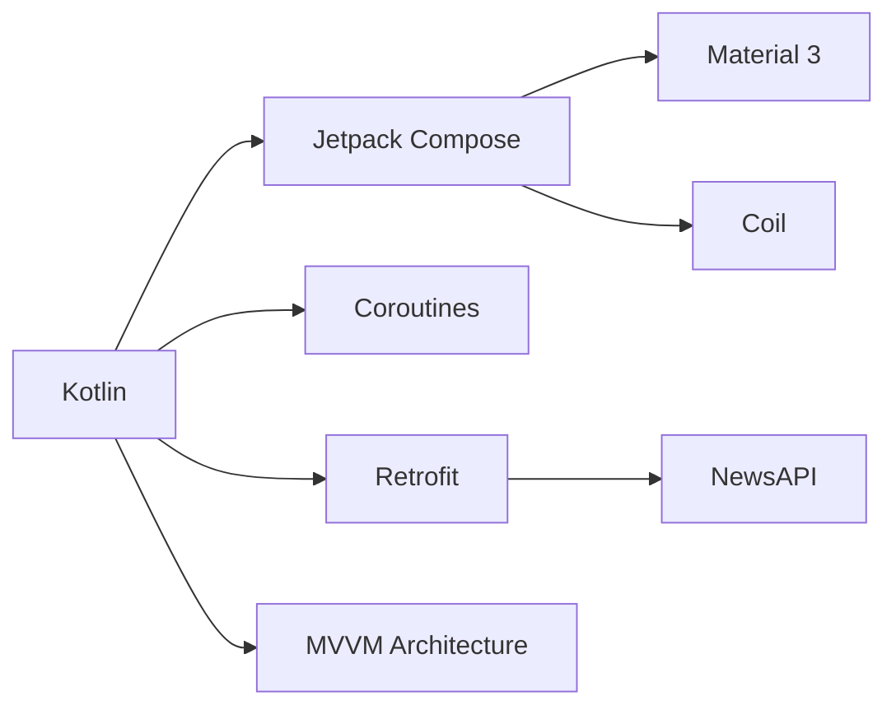
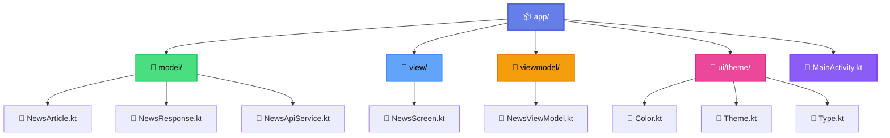
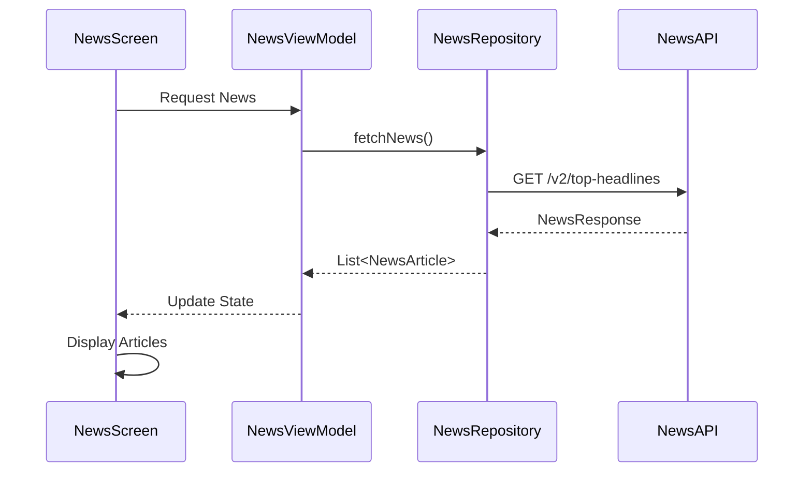
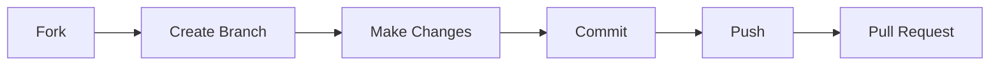

# 📱 Alzajeera News App

<div align="center">


  

### 🚀 A Modern Android News Application

*Built with Kotlin & Jetpack Compose | Powered by NewsAPI.org*

[](https://kotlinlang.org/)
[](https://developer.android.com/jetpack/compose)
[](https://m3.material.io/)
[](https://opensource.org/licenses/MIT)

</div>

---

## 📸 Screenshots

<div align="center">

  <table>
    <tr>
      <td align="center">
        
        <br />
        <sub><b>🏠 Home Screen</b></sub>
        <br />
        <sub>Modern Material 3 Design</sub>
      </td>
      <td align="center">
        
        <br />
        <sub><b>📰 News Article</b></sub>
        <br />
        <sub>Rich Content Display</sub>
      </td>
    </tr>
  </table>

</div>

---

## ✨ Features

<div align="center">

| Feature | Description |
|---------|-------------|
| 📱 **Modern UI** | Beautiful Material 3 Design with Jetpack Compose |
| 📰 **Real-time News** | Live feed from NewsAPI.org |
| 🔄 **Pull to Refresh** | Smooth refresh functionality |
| 🖼️ **Image Loading** | Fast loading with Coil library |
| 🌐 **Network Handling** | Robust error handling & retry |
| 📏 **Responsive Design** | Adapts to all screen sizes |
| 🎨 **Custom Theme** | Material 3 theming system |
| ⚡ **Performance** | Optimized with Kotlin Coroutines |

</div>

---

## 🛠️ Tech Stack

<div align="center">



</div>

### Core Technologies

<table>
  <tr>
    <td align="center" width="20%">
      
      <br /><b>Kotlin</b>
    </td>
    <td align="center" width="20%">
      
      <br /><b>Jetpack Compose</b>
    </td>
    <td align="center" width="20%">
      
      <br /><b>Retrofit</b>
    </td>
    <td align="center" width="20%">
      
      <br /><b>Coil</b>
    </td>
    <td align="center" width="20%">
      
      <br /><b>MVVM</b>
    </td>
  </tr>
</table>

---

## 📁 Project Architecture

<div align="center">



</div>

---

## 🚀 Getting Started

### Prerequisites

<div align="center">

| Requirement | Version |
|------------|---------|
| 🔧 Android Studio | Flamingo+ |
| 🔷 Kotlin | 1.8.0+ |
| 🏗️ Gradle | 8.11.1+ |
| 📱 Min SDK | 24 (Android 7.0) |
| 🎯 Target SDK | 34 (Android 14) |

</div>

### Installation Steps

1️⃣ **Clone the repository**
```bash
git clone https://github.com/DAlgoSculptor/Alzajeera-News-App.git
cd Alzajeera-News-App
```

2️⃣ **Get your API Key**
- Visit [NewsAPI.org](https://newsapi.org/)
- Sign up for a free API key

3️⃣ **Add API Key**
- Open `NewsRepository.kt`
- Replace `YOUR_API_KEY_HERE` with your actual API key:
```kotlin
private val apiKey = "your_actual_api_key_here"
```

4️⃣ **Build & Run**
- Open project in Android Studio
- Sync Gradle
- Run on emulator or device

---

## 📦 Dependencies

<details>
<summary><b>Click to expand dependencies</b></summary>

```gradle
dependencies {
    // Core Android
    implementation 'androidx.core:core-ktx:1.12.0'
    implementation 'androidx.lifecycle:lifecycle-runtime-ktx:2.7.0'
    
    // Compose
    implementation 'androidx.activity:activity-compose:1.8.2'
    implementation platform('androidx.compose:compose-bom:2024.02.00')
    implementation 'androidx.compose.ui:ui'
    implementation 'androidx.compose.ui:ui-tooling-preview'
    implementation 'androidx.compose.material3:material3'
    
    // Networking
    implementation 'com.squareup.retrofit2:retrofit:2.9.0'
    implementation 'com.squareup.retrofit2:converter-gson:2.9.0'
    
    // Image Loading
    implementation 'io.coil-kt:coil-compose:2.5.0'
}
```

</details>

---

## 🎯 Key Features Breakdown

### 🏠 Home Screen
- ✅ Material 3 Design language
- ✅ Lazy column for efficient scrolling
- ✅ Pull-to-refresh functionality
- ✅ Loading states with progress indicators
- ✅ Error handling with retry option

### 📰 News Articles
- ✅ Rich image display
- ✅ Article title and description
- ✅ Source and timestamp
- ✅ Smooth animations
- ✅ Click to read more

### 🔧 Technical Features
- ✅ MVVM architecture pattern
- ✅ Kotlin Coroutines for async operations
- ✅ State management with ViewModel
- ✅ Retrofit for network calls
- ✅ Coil for image loading
- ✅ Material 3 theming system

---

## 📊 API Integration

<div align="center">



</div>

### API Endpoints

| Endpoint | Method | Description |
|----------|--------|-------------|
| `/v2/top-headlines` | GET | Fetch latest news headlines |

**Parameters:**
- `country`: News country (default: `us`)
- `apiKey`: Your NewsAPI key

---

## 🎨 UI Components

<table>
  <tr>
    <th>Component</th>
    <th>Description</th>
    <th>Technology</th>
  </tr>
  <tr>
    <td>📄 <b>NewsScreen</b></td>
    <td>Main composable displaying news list</td>
    <td>Jetpack Compose</td>
  </tr>
  <tr>
    <td>🎴 <b>NewsCard</b></td>
    <td>Individual article card with image & text</td>
    <td>Material 3 Card</td>
  </tr>
  <tr>
    <td>🔄 <b>PullRefresh</b></td>
    <td>Swipe-to-refresh indicator</td>
    <td>Compose Material</td>
  </tr>
  <tr>
    <td>⚠️ <b>ErrorState</b></td>
    <td>Error display with retry button</td>
    <td>Custom Composable</td>
  </tr>
  <tr>
    <td>⏳ <b>LoadingState</b></td>
    <td>Circular progress indicator</td>
    <td>Material 3</td>
  </tr>
</table>

---

## 🤝 Contributing

Contributions are what make the open source community amazing!

<div align="center">



</div>

1. 🍴 Fork the Project
2. 🌿 Create your Feature Branch (`git checkout -b feature/AmazingFeature`)
3. ✍️ Commit your Changes (`git commit -m 'Add some AmazingFeature'`)
4. 🚀 Push to the Branch (`git push origin feature/AmazingFeature`)
5. 🎉 Open a Pull Request

---

## 📝 License

<div align="center">

Distributed under the MIT License. See `LICENSE` for more information.

[](https://opensource.org/licenses/MIT)

</div>

---

## 👨‍💻 Author

<div align="center">

### Danish Nawaz

[](https://github.com/DAlgoSculptor)
[](https://github.com/DAlgoSculptor)

**Project Link:** [Alzajeera News App](https://github.com/DAlgoSculptor/Alzajeera-News-App)

</div>

---

## 🌟 Show Your Support

<div align="center">

If you like this project, please give it a ⭐ on GitHub!

[](https://github.com/DAlgoSculptor/Alzajeera-News-App/stargazers)
[](https://github.com/DAlgoSculptor/Alzajeera-News-App/network/members)

</div>

---

<div align="center">

### 📬 Have Questions?

Feel free to open an issue or reach out!

Made with ❤️ by [Danish Nawaz](https://github.com/DAlgoSculptor)

</div>